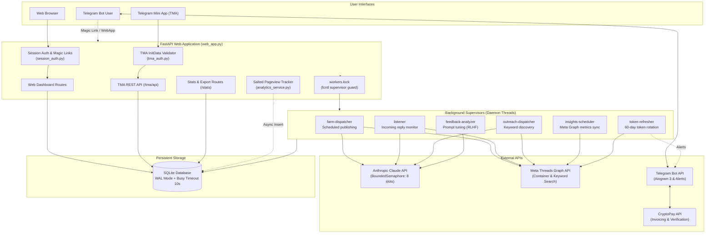

<div align="center">

# 🧵 Threads Bot

**Production-ready, open-source automation suite and management engine for Meta Threads, powered by Claude AI.**

Scheduled post generation, audience engagement, keyword-based outreach, self-optimizing system prompts, and rich analytics — managed from a web dashboard, Telegram Mini App (TMA), and Telegram bot.

[](https://www.python.org/)
[](https://fastapi.tiangolo.com/)
[](https://docs.aiogram.dev/)
[](https://www.sqlite.org/)
[](https://docs.anthropic.com/)
[](LICENSE)
[](CONTRIBUTING.md)

[Features](#-features) · [Architecture](#-architecture) · [Tech Stack](#-tech-stack) · [Project Structure](#-project-structure) · [Quick Start](#-quick-start) · [Configuration](#-configuration) · [Database & Migrations](#-database--migrations) · [Security](#-security) · [License](#-license)

</div>

---

## 📋 Overview

**Threads Bot** is an extensible, self-hosted automation and growth engine designed for multi-account Meta Threads management. Built with FastAPI, Aiogram 3, and Anthropic Claude, it bridges enterprise-grade background orchestration with simple, passwordless user management.

Whether managing a personal creator profile, running marketing experiments, or deploying a multi-tenant subscription SaaS, Threads Bot provides all the plumbing: background dispatchers, safety guards, token refreshers, and analytics.

---

## ✨ Features

### 🤖 Intelligent Content Generation & Styling
- **Claude AI Integration**: Powered by Anthropic Claude (configurable via `ANTHROPIC_MODEL`, default `claude-sonnet-5-5`), with viral style guides cached in-memory ([`post_style_viral_threads.md`](post_style_viral_threads.md)).
- **Diverse Personas (`ai_skill`)**: Built-in voice profiles: `neutral`, `crypto_bro`, `analyst`, `provocateur`, `storyteller`, `hustler`, `philosopher`.
- **Adaptive Content Guard**: [`text_guard.py`](text_guard.py) strips wrapping quotes safely without altering inner dialogue, ensures alphanumeric content density, and enforces Meta's 500-character ceiling.
- **Layered Safety Filters**: Multi-stage ban-word validation preventing spam, adult themes, and financial scams.
- **Multilingual Support**: Out-of-the-box system prompting for English (`en`), Russian (`ru`), and Ukrainian (`uk`).

### 💬 Engagement & Audience Growth
- **Smart Auto-Replies (`listener`)**: Continuously monitors incoming replies on your recent threads and responds with either a fixed template or dynamic, context-aware AI answers. Deduplication guaranteed via SQLite.
- **Keyword-Driven Outreach (`outreach_bot`)**: Discovers target discussions via the Meta Graph API `/keyword_search` endpoint and drops thoughtful replies matching your brand voice. Includes built-in self-commenting prevention.
- **Async Media Polling**: Two-step publishing pipeline that polls Meta's container status (`IN_PROGRESS` → `FINISHED`) for flawless image posts.

### 🧠 Self-Optimizing Prompts (RLHF Loop)
- **Automated Feedback Analyzer (`feedback_analyzer.py`)**: Runs every 6 hours (or on-demand). Computes a weighted engagement score `(likes + replies*2 + reposts*3) / views`, compares top-10% vs bottom-10% performing posts, and uses Claude to synthesize and activate improved system prompts in `system_prompts`.

### 🔑 Automated Token Lifecycle
- **Long-Lived Token Refresher (`token_refresher.py`)**: Automatically scans and refreshes 60-day Meta Graph access tokens older than 20 days.
- **Revocation Alerts**: Detects OAuth errors (code 190) and immediately notifies account owners on Telegram to reconnect their accounts.

### 📊 Privacy-Preserving Analytics
- **Page-View Tracking**: Non-blocking Starlette middleware logging hits into SQLite without slowing HTTP request handling.
- **Salted Anonymization**: IP addresses are hashed using HMAC-SHA256 with `SECRET_AUTH_KEY`; raw client IPs are **never** stored.
- **Insights Aggregation**: Periodically synchronizes views, likes, replies, and reposts directly from Meta into a high-speed daily cache (`stats_cache`).

### 📱 Dual Frontend: Web & Telegram Mini App (TMA)
- **Responsive Web Dashboard**: Jinja2-based dashboard for account parameters, delays, prompt management, and statistics.
- **Telegram Mini App (`/tma`)**: Fully integrated WebApp allowing users to manage accounts and toggle workers natively inside Telegram.
- **Passwordless Auth**: HMAC-SHA256 signed magic links for web browser login, and cryptographic `initData` validation with timestamp freshness for TMA.

### 💳 Monetization & Billing Engine
- **CryptoPay Integration**: Built-in payment gateway ([`aiocryptopay`](https://github.com/aiocryptopay/aiocryptopay)) supporting USDT, TON, BTC, ETH, and other crypto assets.
- **Exactly-Once Crediting**: Atomic invoice status transitions (`pending` → `done`) prevent double-crediting race conditions.
- **Promo Code Engine**: Atomic code redemption with per-user usage tracking, expiration dates, and brute-force protection.
- **Channel Subscription Gate**: Optional Telegram middleware requiring users to follow a specific Telegram channel before accessing bot features (with fail-open fault tolerance).

---

## 🏗️ Architecture



---

## 🧰 Tech Stack

| Layer | Technology | Details |
|---|---|---|
| **Language** | Python 3.10+ | Strict type annotations, asynchronous routines (`asyncio`) |
| **Web Framework** | FastAPI + Uvicorn | High performance, dependency injection, async lifespan |
| **Telegram Bot** | Aiogram 3.x | Modern asynchronous Telegram framework with custom middlewares |
| **Telegram Mini App** | Telegram WebApp SDK + Vanilla JS | Responsive interface, cryptographic `initData` verification |
| **Database** | SQLite (WAL Mode) | Write-Ahead Logging, `busy_timeout=10000`, single source schema |
| **AI Provider** | Anthropic Claude | Claude (Sonnet / Haiku) with thread-safe rate-limit semaphore |
| **Social API** | Meta Threads Graph API | Long-lived OAuth tokens, container publishing, keyword search |
| **Payments** | CryptoBot (aiocryptopay) | Invoices in TON, USDT, BTC, ETH with instant verification |
| **Security** | `itsdangerous` + HMAC-SHA256 | Signed session cookies, time-bound magic links, IP hashing |

---

## 📦 Project Structure

```text
Threads-Bot/
├── .env.example             # Template for environment variables and secrets
├── requirements.txt         # Pinned Python package dependencies
├── config.py                # Environment parser & startup validator
├── schema.py                # Single source of truth for SQLite DDL & indexes
├── db_utils.py              # Database connection helper (WAL mode + timeout)
│
├── web_app.py               # FastAPI application, auth routes, worker supervisor
├── session_auth.py          # Cookie sessions using itsdangerous signed tokens
├── tma_auth.py              # Telegram Mini App initData signature validator
├── tma_routes.py            # REST API endpoints for Telegram Mini App
├── stats_routes.py          # Analytics dashboard, raw JSON, and CSV export
│
├── farm_manager.py          # Worker: Post scheduling, prompt rotation, publisher
├── listener.py              # Worker: Thread reply monitor and auto-replier
├── outreach_bot.py          # Worker: Keyword search and context outreach
├── token_refresher.py       # Worker: 60-day Meta token auto-renewal daemon
├── feedback_analyzer.py     # Worker / CLI: Engagement analyzer & prompt generator
├── analytics_service.py     # Worker & Service: Page views & Meta insights poller
│
├── ai_service.py            # Anthropic Claude API client with retry backoff
├── social_service.py        # Meta Threads Graph API client & container poller
├── text_guard.py            # Alphanumeric density & quote normalization guard
├── post_style_viral_threads.md # Seed guide for viral Threads formatting
│
├── tg_bot.py                # Aiogram 3 Telegram bot: user menu, crypto, admin CLI
├── recovery_tool.py         # Administrative disaster-recovery & payment auditor
│
├── migrations/
│   └── migrate.py           # Standalone idempotent migration runner
│
├── templates/
│   ├── index.html           # Main web dashboard
│   ├── edit.html            # Account settings & persona editor
│   ├── stats.html           # Analytics & engagement charts
│   └── tma.html             # Telegram Mini App interface
│
└── static/                  # CSS styles, assets, and uploaded media
```

---

## 🚀 Quick Start

### Prerequisites

1. **Python 3.10 or higher**
2. **Anthropic API Key**: [console.anthropic.com](https://console.anthropic.com/)
3. **Telegram Bot Token**: Created via [@BotFather](https://t.me/BotFather)
4. **Meta Developer App**: Configure a **Threads App** in the [Meta Developer Portal](https://developers.facebook.com/)
5. **CryptoBot API Token** *(optional)*: Created via [@CryptoBot](https://t.me/CryptoBot) for payment handling

---

### Step 1: Clone and Prepare Environment

```bash
# Clone the repository
git clone https://github.com/your-username/threads-bot.git
cd threads-bot

# Create and activate virtual environment
python -m venv .venv
source .venv/bin/activate       # Linux/macOS
# or: .venv\Scripts\activate    # Windows

# Install dependencies
pip install -r requirements.txt
```

---

### Step 2: Configure Environment Variables

Copy the template configuration file:

```bash
cp .env.example .env
```

Open `.env` in your editor and configure your credentials:

```dotenv
# Required Core Secrets
ANTHROPIC_API_KEY=sk-ant-api03-...
TG_BOT_TOKEN=1234567890:ABCdefGhIJKlmNoPQRsTUVwxyZ
SECRET_AUTH_KEY=use_at_least_32_characters_random_string_here

# Threads / Meta Developer Credentials
THREADS_APP_ID=your_threads_app_id
THREADS_APP_SECRET=your_threads_app_secret
REDIRECT_URI=https://yourdomain.com/auth/threads/callback

# Payments (CryptoBot)
CRYPTO_PAY_TOKEN=12345:AAGMYyourCryptoPayToken

# Server Settings
BASE_URL=https://yourdomain.com
DB_NAME=farm.db
COOKIE_SECURE=1
TRUST_PROXY=1

# Optional Flags
ANTHROPIC_MODEL=claude-sonnet-5-5
THREADS_KEYWORD_SEARCH=0
```

> [!TIP]
> Generate a strong `SECRET_AUTH_KEY` using Python:
> ```bash
> python -c "import secrets; print(secrets.token_hex(32))"
> ```

---

### Step 3: Run Database Migrations

Initialize the SQLite database with all tables, constraints, and indexes:

```bash
python migrations/migrate.py
```

---

### Step 4: Run the Application

The suite consists of two primary services:

#### 1. Web Application & Background Workers
Run the FastAPI web server. On startup, it automatically acquires the single-process lock and spins up the 6 background worker threads:

```bash
uvicorn web_app:app --host 0.0.0.0 --port 8000
```

#### 2. Telegram Bot
In a separate terminal (or systemd service), run the Telegram bot:

```bash
python tg_bot.py
```

Now, open your Telegram bot, run `/start`, and launch either the **Telegram Mini App** or use the **Magic Link** to log into the web dashboard.

---

## ⚙️ Configuration Reference

| Variable | Required | Default | Description |
|---|:---:|---|---|
| `SECRET_AUTH_KEY` | ✅ | — | Random 32+ character key for HMAC signatures and session cookies |
| `ANTHROPIC_API_KEY` | ✅ | — | Anthropic Claude API key |
| `TG_BOT_TOKEN` | ✅ | — | Telegram Bot token from @BotFather |
| `THREADS_APP_ID` | ✅ | — | Meta App ID for Threads OAuth flow |
| `THREADS_APP_SECRET` | ✅ | — | Meta App Secret for exchanging OAuth codes |
| `REDIRECT_URI` | ✅ | — | OAuth callback URL (e.g. `https://domain.com/auth/threads/callback`) |
| `CRYPTO_PAY_TOKEN` | ➖ | — | CryptoBot token for crypto subscription payments |
| `BASE_URL` | ➖ | `https://domain.com` | Public base URL used for generating web magic login links |
| `DB_NAME` | ➖ | `farm.db` | Path to the SQLite database file |
| `ANTHROPIC_MODEL` | ➖ | `claude-sonnet-5-5` | Specific Claude model identifier |
| `THREADS_KEYWORD_SEARCH`| ➖ | `0` | Set to `1` only after Meta approves `threads_keyword_search` in App Review |
| `COOKIE_SECURE` | ➖ | `1` | `1` forces HTTPS `Secure` cookies. Set `0` only for local HTTP debugging |
| `TRUST_PROXY` | ➖ | `1` | Set `1` when deployed behind Caddy/Nginx to read `X-Forwarded-For` |

---

## 🔄 Meta App Review & Permissions Notice

Meta restricts Threads API capabilities based on permission approval levels:

| Permission | Default Status | Required For |
|---|---|---|
| `threads_basic` | Standard | Reading profile data and account ID |
| `threads_content_publish` | Standard | Publishing posts, image containers, and replies |
| `threads_manage_insights` | Standard / Review | Reading views, likes, and reply metrics |
| `threads_keyword_search` | **App Review Required** | Searching public posts by keyword across the platform |

> [!WARNING]
> Without approved `threads_keyword_search` in Meta App Review, Meta's `/keyword_search` endpoint **only returns posts created by the authenticated account itself**.
> The `outreach_bot` detects this and skips self-authored posts. Keep `THREADS_KEYWORD_SEARCH=0` in `.env` until Meta grants your app full keyword search permissions.

---

## 🤖 Telegram Bot & Admin Commands

### User Commands
- `/start` — Register, display main menu, access web dashboard magic link or launch Telegram Mini App.
- `/help` — Usage instructions and feature guide.
- `/code <code>` — Redeem a promo code (rate-limited to 5 attempts/minute).

### Administrator Commands
Admin status is granted to Telegram user IDs defined in `ADMIN_IDS` in [`tg_bot.py`](tg_bot.py) or dynamically promoted via `/mk_boss`.

| Command | Arguments | Description |
|---|---|---|
| `/trial` | `<user_id> [days=3]` | Grant a temporary trial subscription |
| `/gencode` | `<days> [max_accounts] [max_uses] [prefix]` | Generate single-use or multi-use promo codes |
| `/codes` | — | List all active promo codes with remaining uses |
| `/delcode` | `<code>` | Delete or deactivate a promo code |
| `/revoke` | `<user_id>` | Immediately revoke a user's subscription and deactivate bots |
| `/users` | — | Display all registered users and subscription expiration dates |
| `/mk_boss` | `<user_id>` | Dynamically promote a user to admin during runtime |

---

## 🗄️ Database & Migrations

The database is built on **SQLite in WAL mode** (`PRAGMA journal_mode=WAL`), providing high concurrency across web requests and background threads without lock starvation.

### Schema Architecture ([`schema.py`](schema.py))
- `users`: Telegram user profiles, subscription end dates, allowed account quotas.
- `accounts`: Connected Threads accounts, OAuth tokens, styles, delays, proxies, and assigned personas.
- `publications_log`: Log of every published post, reply, and outreach comment, with live metrics.
- `system_prompts`: Active and historical prompts created manually or by the RLHF feedback analyzer.
- `page_views`: Salted HMAC-hashed pageview logs for privacy-first telemetry.
- `stats_cache`: Pre-aggregated daily metrics for high-speed dashboard analytics.
- `invoices`: CryptoPay invoices with immutable state transition tracking.
- `promo_codes` & `promo_uses`: Reconciled promo codes with atomic `uses_left` decrementing.
- `ban_words` & `processed_replies`: Content filtering terms and deduplication keys.

### Running Migrations

```bash
# Standard migration on default DB
python migrations/migrate.py

# Migration on custom database path
python migrations/migrate.py /var/data/custom_farm.db

# Clear legacy placeholder reply phrases
python migrations/migrate.py --clean-placeholders
```

---

## 🛡️ Security

1. **Cryptographic Sessions**: Session cookies are signed with `itsdangerous` using SHA-256 HMAC and timestamp validation.
2. **Strict TMA Authentication**: Telegram Mini App requests validate raw `initData` against `WebAppData` secret keys. Stale signatures (`auth_date > 24h`) and future timestamps are rejected.
3. **Salted IP Privacy**: Client IPs are hashed via `hmac.new(SECRET_AUTH_KEY, ip, sha256)` before storing in `page_views`.
4. **Single-Worker Concurrency Lock**: On Unix systems, `workers.lock` is acquired via `fcntl.flock(LOCK_EX | LOCK_NB)` ensuring only one Uvicorn process runs background dispatchers when scaled horizontally.
5. **Thread-Safe AI Rate Limiting**: Anthropic API requests are metered using a global `threading.BoundedSemaphore(8)` across both synchronous and asynchronous routines.
6. **No Committed Secrets**: All sensitive credentials are kept strictly in `.env`.

---

## ⚖️ Responsible Use & Platform Policy

This tool interacts with the Meta Threads Graph API. Users are strictly responsible for adhering to Meta's developer policies and local laws:
- Only automate accounts that you own or have explicit authorization to manage.
- Respect rate limits and maintain realistic delays (`pub_delay_min` / `pub_delay_max`).
- Do not engage in mass spamming, deceptive impersonation, or harassment.
- Be transparent about automated activity where required by regulations.

The authors assume no liability for misuse, account suspensions, or platform penalties.

---

## 🤝 Contributing

We welcome contributions! To get started:

1. **Fork** the repository.
2. Create a feature branch: `git checkout -b feature/amazing-feature`.
3. Commit your changes: `git commit -m "Add amazing feature"`.
4. Ensure tests or syntax pass: `python -m py_compile *.py`.
5. Open a **Pull Request**.

Please ensure your pull requests follow existing architecture conventions and include no hardcoded secrets or environment-specific paths.

---

## 📄 License

Distributed under the **MIT License**. See [`LICENSE`](LICENSE) for more information.
