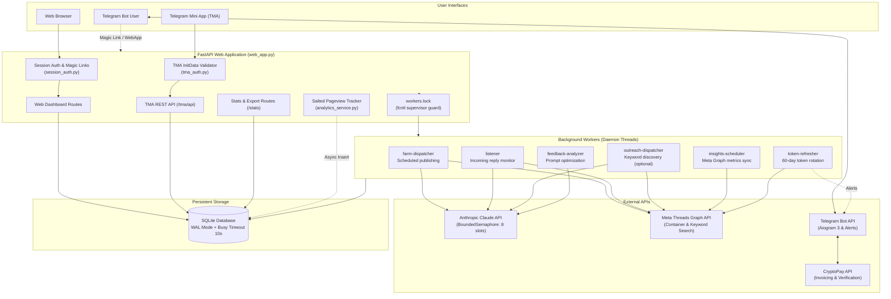

<div align="center">

# 🧵 Threads Bot

**Self-hosted automation and management suite for Meta Threads, powered by Claude AI.**

Scheduled post generation, reply handling, optional keyword-based outreach, engagement-driven prompt optimization, and analytics — managed from a web dashboard, a Telegram Mini App (TMA), and a Telegram bot.

[](https://www.python.org/)
[](https://fastapi.tiangolo.com/)
[](https://docs.aiogram.dev/)
[](https://www.sqlite.org/)
[](https://docs.anthropic.com/)
[](LICENSE)
[](#-project-status)
[](CONTRIBUTING.md)

[Status](#-project-status) · [Features](#-features) · [Architecture](#-architecture) · [Tech Stack](#-tech-stack) · [Project Structure](#-project-structure) · [Quick Start](#-quick-start) · [Configuration](#-configuration-reference) · [Database & Migrations](#-database--migrations) · [Security](#-security) · [Limitations & Roadmap](#-limitations--roadmap) · [License](#-license)

</div>

---

## 📋 Overview

**Threads Bot** is a self-hosted backend for managing multiple Meta Threads accounts. It combines a FastAPI web application, an Aiogram 3 Telegram bot, and a set of background workers that handle publishing, replies, token renewal, and analytics.

The project is a good reference for:

- FastAPI with an async lifespan that supervises background workers
- OAuth 2.0 against an external API, including long-lived token refresh
- Telegram Mini App authentication (`initData` validation)
- Idempotent payment handling and atomic promo code redemption
- Working with rate-limited LLM and social APIs

---

## 📌 Project Status

The bot is **feature-complete and works**, but it is **not actively maintained**.

It was originally built as a product. A public launch requires Meta business verification and App Review for the Threads API, and I decided not to pursue the business side. The code is published as-is, mainly as a portfolio project and as a working example of the stack above.

What this means in practice:

- Without App Review, the app only works for accounts added to your Meta app as testers.
- `threads_keyword_search` requires separate approval, so outreach is **disabled by default** (see [Meta App Review & Permissions](#-meta-app-review--permissions)).
- Issues and pull requests are welcome, but responses may be slow.

---

## 📸 Screenshots

-- Add screenshots or a short GIF here, for example:
[Dashboard](docs/screenshots/dashboard.png)
[Telegram Mini App](docs/screenshots/tma.png)


---

## ✨ Features

### 🤖 Content Generation & Styling
- **Claude integration**: Powered by Anthropic Claude (configurable via `ANTHROPIC_MODEL`, default `claude-sonnet-5-5`), with a style guide cached in memory ([`post_style_viral_threads.md`](post_style_viral_threads.md)).
- **Personas (`ai_skill`)**: Built-in voice profiles: `neutral`, `crypto_bro`, `analyst`, `provocateur`, `storyteller`, `hustler`, `philosopher`.
- **Content guard**: [`text_guard.py`](text_guard.py) strips wrapping quotes without altering inner dialogue, checks alphanumeric density, and enforces Meta's 500-character limit.
- **Layered safety filters**: Multi-stage ban-word validation against spam, adult themes, and financial scams.
- **Languages**: System prompts for English (`en`), Russian (`ru`), and Ukrainian (`uk`).

### 💬 Engagement
- **Auto-replies (`listener`)**: Monitors replies on your recent threads and answers with a fixed template or a context-aware AI reply. Deduplication is handled in SQLite.
- **Keyword outreach (`outreach_bot`, optional, off by default)**: Finds relevant discussions through the Meta Graph API `/keyword_search` endpoint and replies in your brand voice. Includes self-comment prevention. Requires Meta approval for `threads_keyword_search`.
- **Async media publishing**: Two-step pipeline that polls Meta's container status (`IN_PROGRESS` → `FINISHED`) for image posts.

### 🧠 Engagement-Driven Prompt Optimization
- **Feedback analyzer (`feedback_analyzer.py`)**: Runs every 6 hours (or on demand). Computes a weighted engagement score `(likes + replies*2 + reposts*3) / views`, compares the top 10% and bottom 10% of posts, and asks Claude to draft an improved system prompt, which is stored and activated in `system_prompts`.

> This is prompt tuning based on engagement metrics, not model training.

### 🔑 Token Lifecycle
- **Token refresher (`token_refresher.py`)**: Refreshes 60-day Meta long-lived tokens once they are older than 20 days.
- **Revocation alerts**: Detects OAuth errors (code 190) and notifies the account owner in Telegram to reconnect.

### 📊 Privacy-Preserving Analytics
- **Page-view tracking**: Non-blocking Starlette middleware that logs hits into SQLite.
- **Salted anonymization**: IP addresses are hashed with HMAC-SHA256 using `SECRET_AUTH_KEY`; raw client IPs are never stored.
- **Insights aggregation**: Periodically syncs views, likes, replies, and reposts from Meta into a daily cache (`stats_cache`).

### 📱 Web Dashboard & Telegram Mini App
- **Web dashboard**: Jinja2-based UI for account parameters, delays, prompt management, and statistics.
- **Telegram Mini App (`/tma`)**: Manage accounts and toggle workers from inside Telegram.
- **Passwordless auth**: HMAC-SHA256 signed magic links for the web dashboard, and cryptographic `initData` validation with timestamp freshness checks for the TMA.

### 💳 Billing
- **CryptoPay integration**: Payments via [`aiocryptopay`](https://github.com/aiocryptopay/aiocryptopay) in USDT, TON, BTC, ETH, and other assets.
- **Exactly-once crediting**: Atomic invoice status transitions (`pending` → `done`) prevent double crediting.
- **Promo codes**: Atomic redemption with per-user usage tracking, expiration dates, and rate limiting.
- **Channel subscription gate**: Optional Telegram middleware that requires users to follow a channel first (fails open on errors).

---

## 🏗️ Architecture



The web application starts the six background workers in its lifespan handler. A file lock (`workers.lock`) ensures that only one Uvicorn process runs them, even if the web app is scaled to several processes.

---

## 🧰 Tech Stack

| Layer | Technology | Details |
|---|---|---|
| **Language** | Python 3.10+ | Type hints, `asyncio` for I/O-bound work |
| **Web framework** | FastAPI + Uvicorn | Dependency injection, async lifespan, REST endpoints for the TMA |
| **Telegram bot** | Aiogram 3.x | Async Telegram framework with custom middlewares |
| **Telegram Mini App** | Telegram WebApp SDK + Vanilla JS | Cryptographic `initData` verification |
| **Database** | SQLite (WAL mode) | `busy_timeout=10000`, single-source schema |
| **AI provider** | Anthropic Claude | Sonnet / Haiku, retry backoff, global rate-limit semaphore |
| **Social API** | Meta Threads Graph API | Long-lived OAuth tokens, container publishing, keyword search |
| **Payments** | CryptoBot (aiocryptopay) | Invoices in TON, USDT, BTC, ETH |
| **Security** | `itsdangerous` + HMAC-SHA256 | Signed session cookies, time-bound magic links, IP hashing |

---

## 📦 Project Structure

```text
Threads-Bot/
├── .env.example             # Template for environment variables and secrets
├── requirements.txt         # Python dependencies
├── config.py                # Environment parser & startup validator
├── schema.py                # Single source of truth for SQLite DDL & indexes
├── db_utils.py              # Database connection helper (WAL mode + timeout)
│
├── web_app.py               # FastAPI application, auth routes, worker supervisor
├── session_auth.py          # Cookie sessions using itsdangerous signed tokens
├── tma_auth.py              # Telegram Mini App initData signature validator
├── tma_routes.py            # REST API endpoints for the Telegram Mini App
├── stats_routes.py          # Analytics dashboard, raw JSON, and CSV export
│
├── farm_manager.py          # Worker: post scheduling, prompt rotation, publisher
├── listener.py              # Worker: reply monitor and auto-replier
├── outreach_bot.py          # Worker: keyword search and contextual replies
├── token_refresher.py       # Worker: 60-day Meta token renewal
├── feedback_analyzer.py     # Worker / CLI: engagement analysis & prompt generation
├── analytics_service.py     # Service: page views & Meta insights poller
│
├── ai_service.py            # Anthropic Claude API client with retry backoff
├── social_service.py        # Meta Threads Graph API client & container poller
├── text_guard.py            # Alphanumeric density & quote normalization guard
├── post_style_viral_threads.md # Seed style guide for Threads posts
│
├── tg_bot.py                # Aiogram 3 Telegram bot: user menu, payments, admin commands
├── recovery_tool.py         # Admin disaster-recovery & payment auditing tool
│
├── migrations/
│   └── migrate.py           # Standalone idempotent migration runner
│
├── templates/
│   ├── index.html           # Main web dashboard
│   ├── edit.html            # Account settings & persona editor
│   ├── stats.html           # Analytics & engagement charts
│   └── tma.html             # Telegram Mini App interface
│
└── static/                  # CSS styles, assets, and uploaded media
```

---

## 🚀 Quick Start

**Deployment target:** Linux server. The worker lock uses `fcntl`, and the project has been tested on Linux only.

### Prerequisites

1. **Python 3.10 or higher**
2. **Anthropic API key**: [console.anthropic.com](https://console.anthropic.com/)
3. **Telegram bot token**: created via [@BotFather](https://t.me/BotFather)
4. **Meta developer app**: a Threads app configured in the [Meta Developer Portal](https://developers.facebook.com/); add your own Threads accounts as testers
5. **CryptoBot API token** *(optional)*: created via [@CryptoBot](https://t.me/CryptoBot) for payments
6. **A public HTTPS URL** for the OAuth callback and the Mini App (for example, behind Caddy or Nginx)

### Step 1: Clone and Prepare Environment

```bash
git clone https://github.com/mkot85549-cell/Threads-Bot.git
cd threads-bot

python -m venv .venv
source .venv/bin/activate
pip install -r requirements.txt
```

### Step 2: Configure Environment Variables

```bash
cp .env.example .env
```

Edit `.env`:

```dotenv
# Required core secrets
ANTHROPIC_API_KEY=sk-ant-api03-...
TG_BOT_TOKEN=1234567890:ABCdefGhIJKlmNoPQRsTUVwxyZ
SECRET_AUTH_KEY=use_at_least_32_characters_random_string_here

# Threads / Meta developer credentials
THREADS_APP_ID=your_threads_app_id
THREADS_APP_SECRET=your_threads_app_secret
REDIRECT_URI=https://yourdomain.com/auth/threads/callback

# Payments (optional)
CRYPTO_PAY_TOKEN=12345:AAGMYyourCryptoPayToken

# Server settings
BASE_URL=https://yourdomain.com
DB_NAME=farm.db
COOKIE_SECURE=1
TRUST_PROXY=1

# Optional flags
ANTHROPIC_MODEL=claude-sonnet-5-5
THREADS_KEYWORD_SEARCH=0
```

> [!TIP]
> Generate a strong `SECRET_AUTH_KEY`:
> ```bash
> python -c "import secrets; print(secrets.token_hex(32))"
> ```

### Step 3: Run Database Migrations

```bash
python migrations/migrate.py
```

### Step 4: Run the Application

The suite runs as two processes.

**1. Web application and background workers**

On startup the FastAPI app acquires the single-process lock and starts the six background workers:

```bash
uvicorn web_app:app --host 0.0.0.0 --port 8000
```

**2. Telegram bot**

In a separate terminal or as a systemd service:

```bash
python tg_bot.py
```

Open your bot in Telegram, send `/start`, and launch the **Mini App** or use the **magic link** to log in to the web dashboard.

---

## ⚙️ Configuration Reference

| Variable | Required | Default | Description |
|---|:---:|---|---|
| `SECRET_AUTH_KEY` | ✅ | — | Random 32+ character key for HMAC signatures and session cookies |
| `ANTHROPIC_API_KEY` | ✅ | — | Anthropic API key |
| `TG_BOT_TOKEN` | ✅ | — | Telegram bot token from @BotFather |
| `THREADS_APP_ID` | ✅ | — | Meta app ID for the Threads OAuth flow |
| `THREADS_APP_SECRET` | ✅ | — | Meta app secret for exchanging OAuth codes |
| `REDIRECT_URI` | ✅ | — | OAuth callback URL (e.g. `https://domain.com/auth/threads/callback`) |
| `CRYPTO_PAY_TOKEN` | ➖ | — | CryptoBot token for crypto payments |
| `BASE_URL` | ➖ | `https://domain.com` | Public base URL used for magic login links |
| `DB_NAME` | ➖ | `farm.db` | Path to the SQLite database file |
| `ANTHROPIC_MODEL` | ➖ | `claude-sonnet-5-5` | Claude model identifier |
| `THREADS_KEYWORD_SEARCH` | ➖ | `0` | Set to `1` only after Meta approves `threads_keyword_search` |
| `COOKIE_SECURE` | ➖ | `1` | `1` forces HTTPS-only cookies. Use `0` only for local debugging |
| `TRUST_PROXY` | ➖ | `1` | Set to `1` behind Caddy/Nginx to read `X-Forwarded-For` |

---

## 🔄 Meta App Review & Permissions

Meta restricts Threads API capabilities by permission level:

| Permission | Default status | Required for |
|---|---|---|
| `threads_basic` | Standard | Reading profile data and account ID |
| `threads_content_publish` | Standard | Publishing posts, image containers, and replies |
| `threads_manage_insights` | Standard / Review | Reading views, likes, and reply metrics |
| `threads_keyword_search` | **App Review required** | Searching public posts by keyword |

> [!WARNING]
> Without an approved `threads_keyword_search`, Meta's `/keyword_search` endpoint only returns posts created by the authenticated account itself. `outreach_bot` detects this and skips self-authored posts. Keep `THREADS_KEYWORD_SEARCH=0` until Meta grants the permission.

Using the app with accounts other than your own testers requires Meta business verification and App Review. See [Project Status](#-project-status).

---

## 🤖 Telegram Bot & Admin Commands

### User Commands
- `/start` — Register, show the main menu, open the web dashboard via magic link, or launch the Mini App.
- `/help` — Usage instructions and feature guide.
- `/code <code>` — Redeem a promo code (rate-limited to 5 attempts per minute).

### Administrator Commands

Set your own Telegram user IDs in `ADMIN_IDS` in [`tg_bot.py`](tg_bot.py) before the first run. Additional admins can be promoted at runtime with `/mk_boss`.

| Command | Arguments | Description |
|---|---|---|
| `/trial` | `<user_id> [days=3]` | Grant a temporary trial subscription |
| `/gencode` | `<days> [max_accounts] [max_uses] [prefix]` | Generate single-use or multi-use promo codes |
| `/codes` | — | List active promo codes with remaining uses |
| `/delcode` | `<code>` | Delete or deactivate a promo code |
| `/revoke` | `<user_id>` | Revoke a user's subscription and deactivate their bots |
| `/users` | — | List registered users and subscription expiration dates |
| `/mk_boss` | `<user_id>` | Promote a user to admin at runtime |

---

## 🗄️ Database & Migrations

The database is **SQLite in WAL mode** (`PRAGMA journal_mode=WAL`), which allows concurrent reads while web requests and background threads write.

### Schema ([`schema.py`](schema.py))
- `users`: Telegram user profiles, subscription end dates, account quotas.
- `accounts`: Connected Threads accounts, OAuth tokens, styles, delays, proxies, personas.
- `publications_log`: Every published post, reply, and outreach comment, with live metrics.
- `system_prompts`: Active and historical prompts, created manually or by the feedback analyzer.
- `page_views`: Salted, hashed page-view logs.
- `stats_cache`: Pre-aggregated daily metrics for dashboard analytics.
- `invoices`: CryptoPay invoices with tracked state transitions.
- `promo_codes` & `promo_uses`: Promo codes with atomic `uses_left` decrementing.
- `ban_words` & `processed_replies`: Content filter terms and deduplication keys.

### Running Migrations

```bash
# Default database
python migrations/migrate.py

# Custom database path
python migrations/migrate.py /var/data/custom_farm.db

# Clear legacy placeholder reply phrases
python migrations/migrate.py --clean-placeholders
```

---

## 🛡️ Security

1. **Signed sessions**: Session cookies are signed with `itsdangerous` (HMAC-SHA256) with timestamp validation.
2. **Strict TMA authentication**: Mini App requests validate raw `initData` against the `WebAppData` secret. Signatures older than 24 hours and future timestamps are rejected.
3. **Salted IP hashing**: Client IPs are hashed with `hmac.new(SECRET_AUTH_KEY, ip, sha256)` before being stored in `page_views`.
4. **Single-process worker lock**: `workers.lock` is acquired via `fcntl.flock(LOCK_EX | LOCK_NB)`, so only one Uvicorn process runs the background workers.
5. **Global AI rate limit**: Anthropic API calls are metered with a `threading.BoundedSemaphore(8)` across sync and async code paths.
6. **No committed secrets**: All credentials live in `.env`, which must never be committed.

See [Limitations](#-limitations--roadmap) for known gaps, including token storage.

---

## ⚖️ Responsible Use & Platform Policy

This tool talks to the Meta Threads Graph API. You are responsible for following Meta's developer policies and local laws:

- Only automate accounts that you own or are explicitly authorized to manage.
- Respect rate limits and keep realistic delays (`pub_delay_min` / `pub_delay_max`).
- Do not use the tool for mass spam, deceptive impersonation, or harassment.
- Disclose automated activity where regulations require it.

The authors assume no liability for misuse, account suspensions, or platform penalties.

---

## 🚧 Limitations & Roadmap

Known limitations:

- **Single instance**: SQLite and the single-process worker lock suit one server instance and a moderate number of accounts. Horizontal scaling is not supported.
- **Token storage**: Meta access tokens are stored in the SQLite database. Restrict file permissions on the database file. Application-level encryption at rest is not implemented.
- **No automated tests**: The only check in the contribution flow is `python -m py_compile`.
- **Linux only**: Tested on Linux. The worker lock depends on `fcntl`.
- **Meta approval**: Public use requires business verification and App Review (see [Project Status](#-project-status)).

Ideas for future work:

- [ ] `pytest` suite for token handling, billing, promo codes, and text guard
- [ ] CI (lint, type check, tests) via GitHub Actions
- [ ] `Dockerfile` and `docker-compose.yml`
- [ ] Encrypt stored tokens (for example with Fernet and a key from the environment)
- [ ] PostgreSQL support and a job queue (for example Redis) for horizontal scaling
- [ ] Load `ADMIN_IDS` from the environment instead of the source file

---

## 🤝 Contributing

Contributions are welcome.

1. **Fork** the repository.
2. Create a feature branch: `git checkout -b feature/my-change`.
3. Commit your changes: `git commit -m "Describe your change"`.
4. Make sure the code compiles: `python -m py_compile *.py`.
5. Open a **Pull Request**.

Please follow the existing architecture conventions and do not include hardcoded secrets or environment-specific paths.

---

## 📄 License

Distributed under the **MIT License**. See [`LICENSE`](LICENSE) for details.
